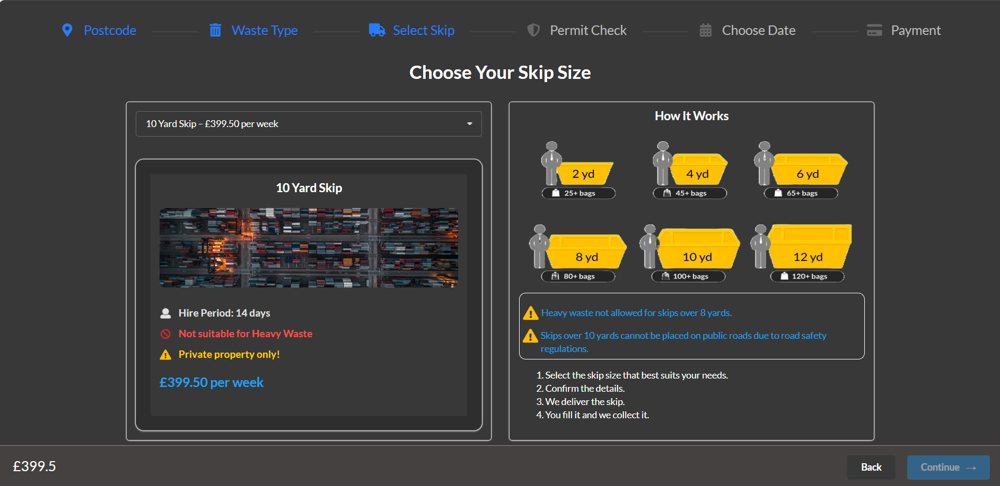
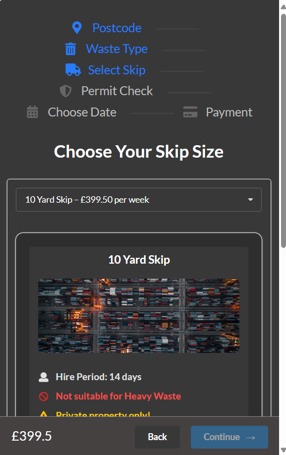

# Select Skip Page - Redesign and Implementation

## Overview
This project involved redesigning the **"Select Skip"** step of the skip ordering process for the website [WeWantWaste](https://wewantwaste.co.uk). The goal was to improve the visual layout, responsiveness, and usability, while integrating real-time API data and supporting mobile and desktop users.

## Screenshots

### Desktop View


### Mobile View


## API Integration
We fetch available skips from the backend API:
```ts
GET https://app.wewantwaste.co.uk/api/skips/by-location?postcode=NR32&area=Lowestoft
```

This is done through a custom hook (`useSkips.js`) which returns:
- `skips`: array of skip objects
- `loading`: loading status
- `selectedId` / `setSelectedId`: skip selection control

## Component Structure

### `App.js`
- Loads skip data
- Maintains `selectedId`, `price`, and `btnDisabled` state
- Composes layout from `Header`, `SelectSkip`, `Footer`

### `SelectSkip.js`
- Displays dropdown to select skip
- Shows skip image, hire info, and conditional warnings
- Has consistent grid layout for 2 cards

### `Footer.js`
- Displays current price and navigation buttons

### `Header.js`
- Displays steps that need to be completed for hiring a skip

---

## Technologies Used

- **React.js**
- **Semantic UI React**
- **CSS Modules**
- **ESLint**


